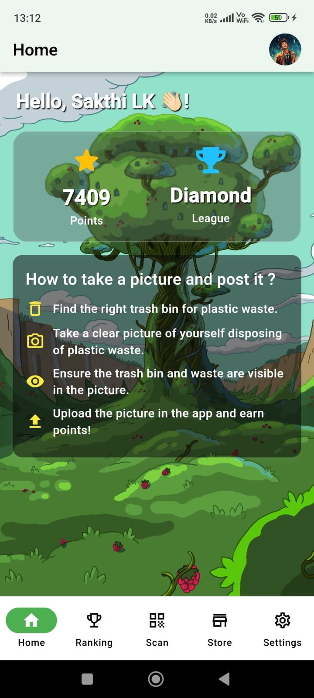
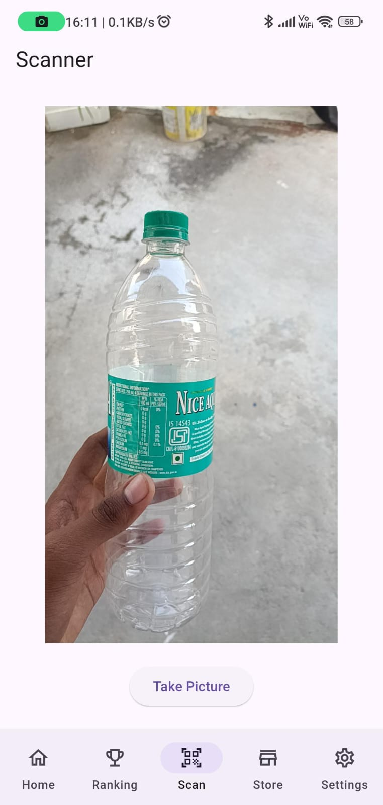
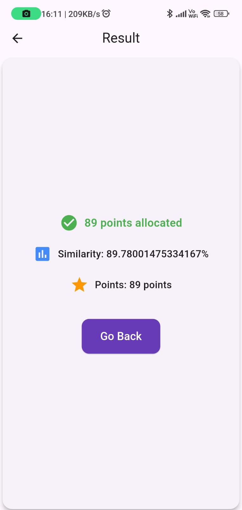
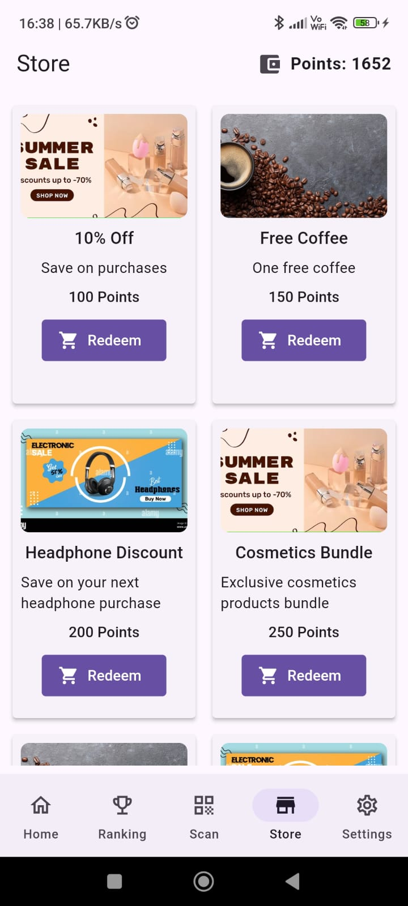

# ♻️ Plentastic

**Plentastic** is a Flutter-based mobile app that rewards users for responsibly disposing of plastic waste. Users earn points by uploading images of collected plastic, which can later be redeemed for real-world rewards and coupons. Built entirely on **Flutter + Flask**

---

## 🌟 Features

- 📸 Upload images of collected plastic
- 📍 Submit location and description of disposal
- 🪙 Earn points for every verified submission
- 🎁 Redeem points for coupons and rewards
- 🔒 User-specific point tracking
- 📊 Admin portal for reward management

---

## 📸 App Screenshots

| Home | Scan | Result | Store |
|------|--------|---------|---------|
|  |  |  |  |

---

## ▶️ Demo Video

